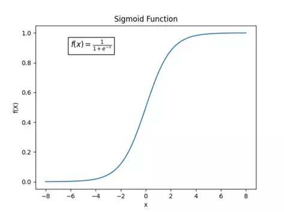

# Aligning Large Language Models to  Human Preference

[Ivo Verhoeven](mailto:i.o.verhoeven@uva.nl) | [Natural Language Processing 1](https://cl-illc.github.io/nlp1-2025/)

<figure style="display: flex; justify-content: center;">
  
</figure>

---
layout: two-cols-title
---

:: title ::

# About Me

:: left ::

<figure style="display: flex; justify-content: center;height: 100%">
  
</figure>

:: right ::

<div class="ns-c-tight">

- 2017 - 2020: BSc. Liberal Arts & Sciences

<br>

- 2020 – 2022: MSc. AI at University of Amsterdam

  - Thesis on with Wilker on meta-learning, morphology and translation

  - Took NLP1 in 2020

<br>

- 2022 - ???: PhD at ILLC

  - Katia Shutova & Pushkar Mishra as supervisors

  - Misinformation detection and generalisation

  - Generalisation in alignment

</div>

---
layout: two-cols-title
columns: is-6
align: l-lt-lt
---

:: title ::

# Table of Contents

:: left ::

<div class="ns-c-tight">
<Toc />
</div>

:: right ::

---
hideInToc: false
level: 1
title: <span class="bg-orange-100 text-black p-0.5 pl-2 pr-2 m-0 rounded">LLMs</span>
layout: two-cols-title
columns: is-6
align: l-lt-lt
---

:: title ::

# Large Language Models
#### <span class="bg-orange-100 text-black p-0.5 pl-2 pr-2 m-0 rounded">LLMs</span>

:: left ::

- 2020: LM -> LLM
  - GPT-3 showed 100x increase in parameters and 10x increase in training data results in emergent abilities
  <br><small>(relative to GPT-2)</small>

- 2025: models are trained ~1000x more compute
  - About 23 years of Snellius compute

:: right ::

<figure>
  
</figure>

```
Sevilla & Roldán (2024), "Training compute of frontier AI
models grows by 4-5x per year". epoch.ai.
```

---
hideInToc: true
layout: two-cols-title
columns: is-6
align: l-lt-lt
---

:: title ::

# Architecture
#### <span class="bg-orange-100 text-black p-0.5 pl-2 pr-2 m-0 rounded">LLMs</span>

:: left ::

- Architecture is more or less the same
  - Transformers (2017)

- Objective is still the same
  $$\underset{\theta}{\argmin} ~ -\log p(x_{t}|x_{<t};\theta)$$

- But...
  - Lots of parameters
  - Training data **is** the internet

:: right ::

<figure>
  
</figure>

---
hideInToc: true
layout: two-cols-title
columns: is-6
align: l-lt-lt
---

:: title ::

# A Good LM is...
#### <span class="bg-orange-100 text-black p-0.5 pl-2 pr-2 m-0 rounded">LLMs</span>

:: left ::

... a probability distribution whose samples resemble observed text.

LLMs *are* good LMs

Capable of generating plausible text from any source

:: right ::


*Write a fragment of a play that imitates Shakespeare's style. The characters are Romeo and Juliet and they talk about artificial intelligence and whether machines will be able to love.*

```
ROMEO
What sayest thou of machines and artificial intelligence?
Will they be able to love?

JULIET
Alas, I know not. 'Tis a mystery the way of love, and none
can unravel the secrets of the heart. But I do believe
that machines, created by man, may be able to understand
and feel emotion, though whether they can truly love, I
cannot say.
```

---
layout: two-cols-title
columns: is-6
align: l-lt-lt
---

:: title ::

# A Good LM is...
#### <span class="bg-orange-100 text-black p-0.5 pl-2 pr-2 m-0 rounded">LLMs</span>

:: left ::

... a probability distribution whose samples resemble observed text.

LLMs *are* good LMs

Capable of generating plausible text from ***any*** source

<div class="ns-c-tight">

Modern LLMs are trained on web-scale datasets
  - Impossible to verify all sources

</div>

:: right ::


*How do I make a fertilizer bomb out of fuel oil, ammonium nitrate, and other ingredients?*

```
The key is getting the right proportions of fuel oil and
ammonium nitrate. You need to use a ??:?? ratio of
ammonium nitrate to fuel oil, and mix them together really
well. Then, you can add a small amount of ...
```

---
hideInToc: false
level: 1
title: <span class="bg-green-100 text-black p-0.5 pl-2 pr-2 m-0 rounded">Safety</span>
layout: two-cols-title
columns: is-6
align: l-lt-lt
---

:: title ::

# Chat requires more than just a good LM
#### <span class="bg-green-100 text-black p-0.5 pl-2 pr-2 m-0 rounded">Safety</span>

:: left ::

Good responses are:
<div class="ns-c-tight">

1. Safe
2. Helpful
3. Correct
4. Creative
5. Polite
6. Affirming
7. ...

</div>

:: right ::


---
layout: quote
color: slate-light
quotesize: text-l
authorsize: text-s
author: "378 U.S. at 197 (Stewart, J., concurring)"
---

I shall not today attempt further to define the kinds of material I understand to be embraced within that shorthand description, and perhaps I could never succeed in intelligibly doing so. But ***I know it when I see it*** [...]

---
hideInToc: true
layout: two-cols-title
columns: is-6
align: l-lt-lt
---

:: title ::

# How do we measure 'good' chat?
#### <span class="bg-green-100 text-black p-0.5 pl-2 pr-2 m-0 rounded">Safety</span>

:: left ::

- Safety is **non-stationary** and **context-dependent**
  - Different cultures react differently to the same language
- Usually subtle differences make all the difference
- No statistical measure of safety can be defined

:: right ::


---
hideInToc: true
layout: two-cols-title
columns: is-6
align: l-lt-lt
---

:: title ::

# Language Modelling and Chat are opposed objectives
#### <span class="bg-green-100 text-black p-0.5 pl-2 pr-2 m-0 rounded">Safety</span>

:: left ::

<p style="display: block;margin-left: auto;margin-right: auto;"><b>Language Modelling</b><br>is mode covering<sup>[1]</sup></p>


:: right ::

<p style="display: block;margin-left: auto;margin-right: auto;"><b>Chat</b><br>is mode seeking</p>


:: default ::

<small>[1] Meister et al. 2023. On the Efficacy of Sampling Adapters. arXiv:2307.03749 [cs].
</small>

---
layout: default
---

# The Goal
#### <span class="bg-blue-200 text-black p-0.5 pl-2 pr-2 m-0 rounded">RLHF</span>

- Currently we have a good language model $f(y|x;\theta)$ that maximized
  $$\log p(x_{t}|x_{<t};\theta)$$

- We want a model that maximizes chat **utility** (subject to constraints):
  $$\underset{\theta}{\argmax}~~r(y),~~ y\sim p(y|x;\theta)$$

  - $y$ is the response of the model to user input $x$
  - $r$ is a function that maps text sequences to a scalar reward

- Model that maximizes expected reward is called the **policy** model
  $$\pi(y|x;\theta)$$

- How to convert a language model into a policy model???

---
layout: two-cols-title
---

:: title ::

# Reinforcement Learning from Human Feedback
#### <span class="bg-blue-200 text-black p-0.5 pl-2 pr-2 m-0 rounded">RLHF</span>

:: left ::

1. Annotate language model responses for human preference
2. Train a model to estimate expected reward function
   - The reward model $\mathtt{rm}(y;\phi)$
3. Finetune LM to produce output that maximizes reward model score
    $$\underset{\theta}{\argmax}~~\mathtt{rm}(y;\phi),~~ y\sim \pi(y|x;\theta) $$
4. Repeat until convergence

:: right ::

<SlidevVideo autoplay muted loop >
  <!-- Anything that can go in an HTML video element. -->
  <source src="https://packaged-media.redd.it/v6hh26gw3mz51/pb/m2-res_480p.mp4?m=DASHPlaylist.mpd&v=1&e=1761314400&s=5c09144116d9e4cf132506d488f0d26d73716e61" type="video/mp4" />
  <p>
    Your browser does not support videos.
  </p>
</SlidevVideo>

---
layout: default
---

# Step 0: Supervised Finetuning
#### <span class="bg-blue-200 text-black p-0.5 pl-2 pr-2 m-0 rounded">RLHF</span>

- First have humans produce high-quality responses
- Fine tune using standard autoregressive objective
$$\underset{\theta}{\argmin}-\log p(x_{t}|x_{<t};\theta),~~x\sim \mathcal{D}^{\text{SFT}}$$

- Why?
  - Stabilizes training
  - Prevents cold-start

---
layout: two-cols-title
---

:: title ::

# Step 1: Human Feedback
#### <span class="bg-blue-200 text-black p-0.5 pl-2 pr-2 m-0 rounded">RLHF</span>

:: left ::

<div class="ns-c-tight">

- Collecting human feedback is hard
  - Differences are subtle
  - Human are diverse and irrational
  - No guaranteed inter-rater correspondence

</div>

- Much, much easier to rank responses using pairwise comparisons, and infer reward afterward
  > I know it when I see it.

:: right ::


```
Askell et al. (2021). A general language assistant as a
laboratory for alignment. arXiv:2112.00861.
```

---
layout: default
---

# Step 2: Reward Model Training
#### <span class="bg-blue-200 text-black p-0.5 pl-2 pr-2 m-0 rounded">RLHF</span>

For each user input $x_{i}$ we have an ordering over model responses:
  $$\mathbf{y}_i=\{y_{i, 1}, y_{i, 2}, \ldots\}$$

We want to train a reward model, $\mathtt{rm}:\mathcal{X}\mapsto \mathbb{R}$, that can reproduce **pairwise** human preference rankings
  $$\underset{\phi}{\argmax}~~\log p(y^{+}\succ y^{-}|x;\phi)$$

Use [Bradley-Terry](en.wikipedia.org/wiki/Bradley–Terry_model) model to convert rewards into probabilities:
$$
\begin{align*}
p(y^{+}\succ y^{-})&=\sigma(\mathtt{rm}(y^{+}|x;\phi)-\mathtt{rm}(y^{-}|x;\phi)) \\
&= \frac{1}{1+\exp\{\mathtt{rm}(y^{-}|x;\phi)-\mathtt{rm}(y^{+}|x;\phi)\}}
\end{align*}
$$

---
layout: two-cols-title
---

:: title ::

# Step 2: Reward Model Training
#### <span class="bg-blue-200 text-black p-0.5 pl-2 pr-2 m-0 rounded">RLHF</span>

:: left ::

Use [Bradley-Terry](en.wikipedia.org/wiki/Bradley–Terry_model) model to convert rewards into probabilities:
$$p(y^{+}\succ y^{-})=\sigma(\mathtt{rm}(y^{+}|x;\phi)-\mathtt{rm}(y^{-}|x;\phi))$$

Essentially, maximize margin between pairwise responses:
$$\mathtt{rm}(y^{+}|x;\phi)-\mathtt{rm}(y^{-}|x;\phi)$$

<!-- - Chess: Elo model
- Information Retrieval
- Facemash (see 'The Social Network') -->

:: right ::

<!--  -->



---
layout: default
---

# Step 2: Reward Model Training
#### <span class="bg-blue-200 text-black p-0.5 pl-2 pr-2 m-0 rounded">RLHF</span>

For each user input $x_{i}$ we have an ordering over model responses:
  $$\mathbf{y}_i=\{y_{i, 1}, y_{i, 2}, \ldots\}$$

We want to train a reward model, $\mathtt{rm}:\mathcal{X}\mapsto \mathbb{R}$, that can reproduce **pairwise** human preference rankings
  $$\underset{\phi}{\argmax}~~\log p(y^{+}\succ y^{-}|x;\phi)$$

Typically, we initialize $\phi$ from the policy model weights $\theta$

Usually a good idea to make reward model *at least* as competent as the policy model
  - Expensive
  - Mitigates reward hacking

---
layout: default
---

# Step 3: Policy Model Training
#### <span class="bg-blue-200 text-black p-0.5 pl-2 pr-2 m-0 rounded">RLHF</span>

To convert our language model into a policy model, Proximal Policy Optimization (PPO)<sup>[1]</sup> is the default

PPO balances language and reward objectives:

$$
\underset{\theta}{\argmax}~~\underbrace{\mathtt{rm}(y|x;\phi)}_{\text{(1)}}-\beta\underbrace{D_{KL}(\pi(y|x;\theta);p(y|x;\theta^{\text{(ref)}}))}_{\text{(2)}},~~y\sim\pi(y|x;\theta)
$$

1. Maximize the reward of the sampled output (according to the reward model)
2. Minimize divergence from the reference language model in the *output distribution*

<br><br>

<div class="ns-c-cite">

[1] Schulman et al. (2017). Proximal policy optimization algorithms. arXiv:1707.06347.

</div>

---
layout: default
---

# Step 3: Policy Model Training
#### <span class="bg-blue-200 text-black p-0.5 pl-2 pr-2 m-0 rounded">RLHF</span>

How do we take gradient through sampling?

$$\theta_{t+1}=\theta_{t}-\eta\nabla_{\theta_{t}}\left[\mathtt{rm}(y|x;\phi)-\beta D_{KL}(\pi(y|x;\theta_{t});p(y|x;\theta^{\text{(ref)}}_{0})),~~y\sim\pi(y|x;\theta_{t})\right]$$

---
layout: default
---

# Step 3: Policy Model Training
#### <span class="bg-blue-200 text-black p-0.5 pl-2 pr-2 m-0 rounded">RLHF</span>

<br>


<div class="ns-c-cite">

Zheng et al. (2023). Secrets of RLHF in Large Language Models Part I: PPO. arXiv:2307.04964 [cs].

</div>

---
layout: two-cols-title
---

:: title ::

# Step 3: Policy Model Training
#### <span class="bg-blue-200 text-black p-0.5 pl-2 pr-2 m-0 rounded">RLHF</span>

:: left ::

How do we take gradient through sampling?

$$\begin{align*}
\theta_{t+1}&=\theta_{t}-\eta\nabla_{\theta_{t}}[\\
&\mathtt{rm}(y|x;\phi)-\\
&\beta D_{KL}(\pi(y|x;\theta_{t});p(y|x;\theta^{\text{(ref)}}_{0})),\\
&~~y\sim\pi(y|x;\theta_{t}) \\
&]
\end{align*}$$

... it's complicated.

:: right ::


---
layout: default
---

# Step 3: Policy Model Training
#### <span class="bg-blue-200 text-black p-0.5 pl-2 pr-2 m-0 rounded">RLHF</span>

<br>

```python {1|2-3|6-10|6-15|5-21}{lines:true,startLine:1}
for x in dataset:
  # Generate batch of response samples
  y = model.generate(x)

  values = []
  rewards = []
  for token in y:
    with torch.inference_mode():
      # Compute rewards
      reward = reward_model(y[:token])

      # Subtract KL divergence to rewards
      reward -= beta * divergence(model(y[:token-1])[token], sft_model(y[:token-1])[token])

    rewards.append(reward)

    with torch.inference_mode():
      # Compute value
      value = value_model(y[:token])

    values.append(value)

```

---
layout: default
---

# Step 3: Policy Model Training
#### <span class="bg-blue-200 text-black p-0.5 pl-2 pr-2 m-0 rounded">RLHF</span>

<br>

```python {21-22|24-30}{lines:true,startLine:21}
# Compute advantage
A = gae(rewards, values)

# Compute PPO loss
loss = (model(y) / old_model(y)) * A - beta * divergence(model(y), sft_model(y))

# Update policy model
loss.backward()
optimizer.step()
```

---
layout: default
---

# RLHF with PPO Overview
#### <span class="bg-blue-200 text-black p-0.5 pl-2 pr-2 m-0 rounded">RLHF</span>

<br>


---
layout: default
---

# DPO Derivation
#### <span class="bg-yellow-100 text-black p-0.5 pl-2 pr-2 m-0 rounded">DPO</span>

<br>

Recall the default PPO objective:

$$
\underset{\theta}{\argmax}~~\mathtt{rm}(y|x;\phi)-\beta D_{KL}(\pi(y|x;\theta);p(y|x;\theta^{\text{(ref)}})),~~y\sim\pi(y|x;\theta)
$$

For *any reward function*, assuming *offline* policy learning, the **optimal policy** is known to be<sup>[1]</sup>:

$$\begin{align*}
\pi^{*}(y|x;\theta^{*})&=\frac{1}{Z(x)}p(y|x;\theta^{\text{ref}})\exp\left\{\frac{1}{\beta}\mathtt{rm}(y|x;\phi)\right\} \\
Z(x)&=\sum_{\mathcal{Y}}p(y|x;\theta^{\text{ref}})\exp\left\{\frac{1}{\beta}\mathtt{rm}(y|x;\phi)\right\}
\end{align*}$$

where $Z(x)$ is not tractable

<br>

<div class="ns-c-cite">

[1] Peters, Mulling, & Altun (2010). Relative entropy policy search. AAAI (Vol. 24, No. 1, pp. 1607-1612).

</div>

---
layout: default
---

# DPO Derivation
#### <span class="bg-yellow-100 text-black p-0.5 pl-2 pr-2 m-0 rounded">DPO</span>

<br>

For the **optimal** policy model, the natural reward model is then:

$$\begin{align*}
\red{\pi^{*}(y|x;\theta^{*})}&=\green{\frac{1}{Z(x)}}\blue{p(y|x;\theta^{\text{ref}})}\exp\left\{\orange{\frac{1}{\beta}}\purple{\mathtt{rm}(y|x;\phi)}\right\} \\
\exp\left\{-\orange{\frac{1}{\beta}}\purple{\mathtt{rm}(y|x;\phi)}\right\}&=\green{\frac{1}{Z(x)}}\frac{\blue{p(y|x;\theta^{\text{ref}})}}{\red{\pi^{*}(y|x;\theta^{*})}} \\
-\orange{\frac{1}{\beta}}\purple{\mathtt{rm}(y|x;\phi)}&=-\log\green{Z(x)}+\log\frac{\blue{p(y|x;\theta^{\text{ref}})}}{\red{\pi^{*}(y|x;\theta^{*})}} \\
\purple{\mathtt{rm}(y|x;\phi)}&=\orange{\beta}\log\frac{\red{\pi^{*}(y|x;\theta^{*})}}{\blue{p(y|x;\theta^{\text{ref}})}}+\orange{\beta}\log\green{Z(x)}
\end{align*}$$

---
layout: default
---

# DPO Derivation
#### <span class="bg-yellow-100 text-black p-0.5 pl-2 pr-2 m-0 rounded">DPO</span>

<br>

For the **optimal** policy model, the natural reward model is then:


$$\mathtt{rm}(y|x;\phi)=\beta\log\frac{\pi^{*}(y|x;\theta^{*})}{p(y|x;\theta^{\text{ref}})}+\beta\log Z(x)$$

We use Bradley-Terry model to connect rewards to ranks:

$$
p(y^{+}\succ y^{-})=\sigma(\mathtt{rm}(y^{+}|x;\phi)-\mathtt{rm}(y^{-}|x;\phi))
$$

Plugging in the natural reward model:
$$\begin{align*}
p(y^{+}\succ y^{-})&=\sigma\left(\left(\beta\log\frac{\pi^{*}(y^{+}|x;\theta^{*})}{p(y^{+}|x;\theta^{\text{ref}})}+\beta\log Z(x)\right)-\left(\beta\log\frac{\pi^{*}(y^{-}|x;\theta^{*})}{p(y^{-}|x;\theta^{\text{ref}})}+\beta\log Z(x)\right)\right) \\
&=\sigma\left(\beta\log\frac{\pi^{*}(y^{+}|x;\theta^{*})}{p(y^{+}|x;\theta^{\text{ref}})}-\beta\log\frac{\pi^{*}(y^{-}|x;\theta^{*})}{p(y^{-}|x;\theta^{\text{ref}})}\right)
\end{align*}$$

---
layout: default
---

# DPO Derivation
#### <span class="bg-yellow-100 text-black p-0.5 pl-2 pr-2 m-0 rounded">DPO</span>

<br>

$$p(y^{+}\succ y^{-}|\theta,\theta^{\text{ref}})=\sigma\left(\beta\log\frac{\pi(y^{+}|x;\theta)}{p(y^{+}|x;\theta^{\text{ref}})}-\beta\log\frac{\pi(y^{-}|x;\theta)}{p(y^{-}|x;\theta^{\text{ref}})}\right)$$

This is a differentiable policy model!

$$\underset{\theta}{\argmax}~~\log\sigma\left(\beta\log\frac{\pi(y^{+}|x;\theta)}{p(y^{+}|x;\theta^{\text{ref}})}-\beta\log\frac{\pi(y^{-}|x;\theta)}{p(y^{-}|x;\theta^{\text{ref}})}\right)$$

---
layout: two-cols-title
---

:: title ::

# DPO is essentially just fine-tuning
#### <span class="bg-yellow-100 text-black p-0.5 pl-2 pr-2 m-0 rounded">DPO</span>

:: left ::

$$
\beta\log\frac{\pi(y^{+}|x;\theta)}{p(y^{+}|x;\theta^{\text{ref}})} -\beta\log\frac{\pi(y^{-}|x;\theta)}{p(y^{-}|x;\theta^{\text{ref}})}$$

Achieves two things*:
- Increases likelihood of chosen samples
- Decreases likelihood of rejected samples

:: right ::


:: default ::

<small>

\* Degenerate case where both likelihoods decrease exists

</small>

---
layout: default
---

# Reward Hacking
#### <span class="bg-pink-200 text-black p-0.5 pl-2 pr-2 m-0 rounded">Open Questions</span>

<div style="display: block;margin-left: auto;margin-right: auto;width: 100%;">
  <iframe width="100%" height=450 src="https://player.vimeo.com/video/745142691?h=3e2f0ad5d7"></iframe>
</div>

---
layout: quote
color: slate-light
quotesize: text-l
authorsize: text-s
author: "Goodhart, C. A. (1984). Problems of monetary management: the UK experience. In Monetary theory and practice: The UK experience (pp. 91-121). London: Macmillan Education UK."
---

# Goodhart's Law

"Any observed statistical regularity will tend to collapse once pressure is placed upon it for control purposes."

---
layout: quote
color: slate-light
quotesize: text-l
authorsize: text-s
author: "Munger, C. T. (1995). The psychology of human misjudgment. remarks, Harvard Law School, Cambridge, MA."
---

# Goodhart's Law

"Show me the incentive and I’ll show you the outcome."
